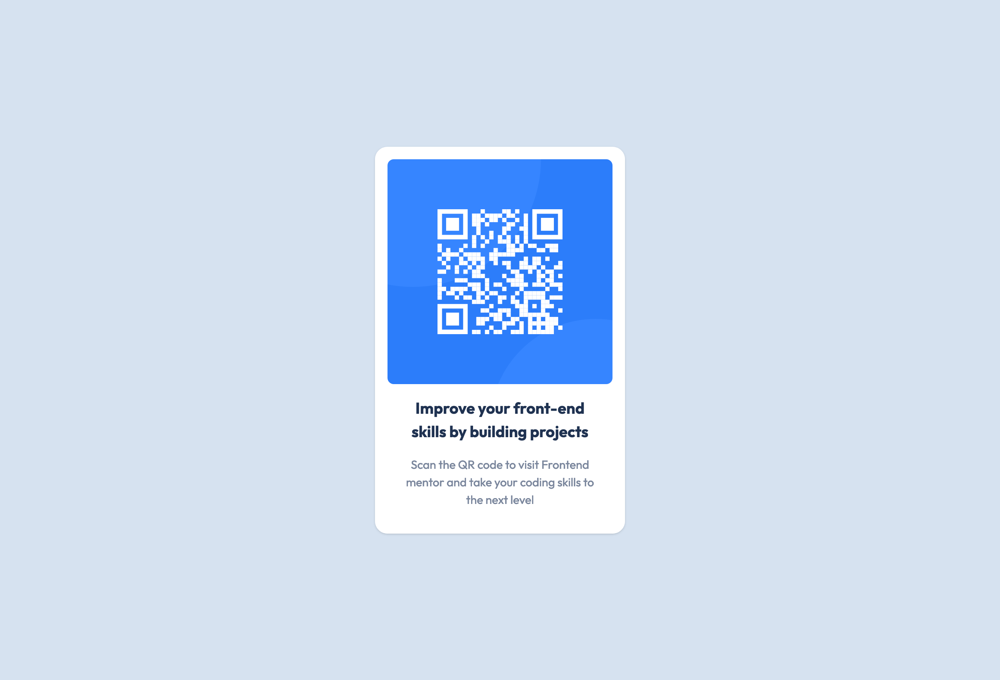

# Frontend Mentor - QR code component solution

This is a solution to the [QR code component challenge on Frontend Mentor](https://www.frontendmentor.io/challenges/qr-code-component-iux_sIO_H). Frontend Mentor challenges help you improve your coding skills by building realistic projects.

## Table of contents

- [Overview](#overview)
  - [Screenshot](#screenshot)
  - [Links](#links)
- [My process](#my-process)
  - [Built with](#built-with)
  - [What I learned](#what-i-learned)
  - [Continued development](#continued-development)
  - [Useful resources](#useful-resources)
- [Author](#author)
- [Acknowledgments](#acknowledgments)

**Note: Delete this note and update the table of contents based on what sections you keep.**

## Overview

### Screenshot

### Links

- Live Site URL: [Github Page](https://pierre-lourens.github.io/FE_mentor_qr_code_component/)

## My process

For this project, I specifically wanted to practice Tailwind and React, since I don't use them in my daily work. I also wanted to have a quick proof-of-concept for working on a front end mentor project.

Bundling with Vite was fun, too, since it demonstrated to me how speedy it is.

The commit history shows my working process in general. Tailwind was fun to use. Back when I had used Bootstrap, I grew wary of css utilities (in favor of styled components), but I like that tailwind's documentation shows exactly what CSS rules it is applying.

### Built with

- React
- Tailwind
- Vite

### What I learned

This is more of a meta learning about doing tiny challenges like this one: it's worth it. For side projects, I end up deliberating a lot on ideas and requirements.

That deliberation is likely worth it for something I'd truly like to build out and scale. But that practice should be tempered with a high quantity of small projects, where I can practice and try things out in a low-stakes environment and where the decisions about design/features are already made.

When it comes to learning, you need quantity and quality.

### Continued development

I'd like to do more Tailwind practice until the syntax becomes second nature. Would also like to demo my ability to work with APIs, state, and context in React, since my github is a bit out of date in that regard.

## Author

- LinkedIn - [Pierre Lourens](https://www.linkedin.com/in/pierre-lourens)
